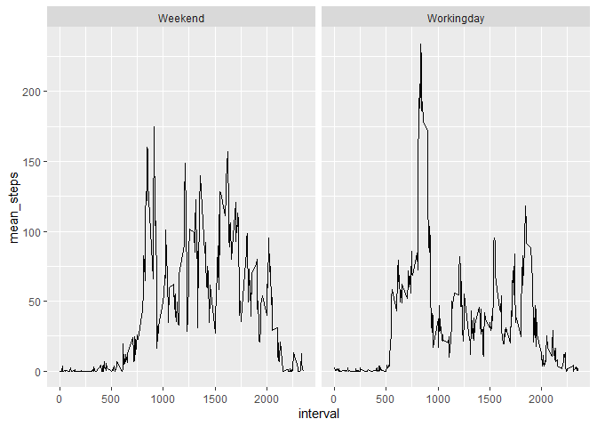

1.  Code for reading in the dataset and/or processing the data

Having loaded all the packages needed, I use the read.csv-function to
read in the data and the ymd-function from the lubridate package to
convert the date column into the appropriate date format. Let`s give it a try...

    library(lubridate)

    ## 
    ## Attaching package: 'lubridate'

    ## The following object is masked from 'package:base':
    ## 
    ##     date

    library(tidyverse)

    ## -- Attaching packages ---------------------------------------------------------------------- tidyverse 1.3.0 --

    ## v ggplot2 3.2.1     v purrr   0.3.3
    ## v tibble  2.1.3     v dplyr   0.8.3
    ## v tidyr   1.0.0     v stringr 1.4.0
    ## v readr   1.3.1     v forcats 0.4.0

    ## -- Conflicts ------------------------------------------------------------------------- tidyverse_conflicts() --
    ## x lubridate::as.difftime() masks base::as.difftime()
    ## x lubridate::date()        masks base::date()
    ## x dplyr::filter()          masks stats::filter()
    ## x lubridate::intersect()   masks base::intersect()
    ## x dplyr::lag()             masks stats::lag()
    ## x lubridate::setdiff()     masks base::setdiff()
    ## x lubridate::union()       masks base::union()

    library(dplyr)

    data <- read.csv("C:\\Users\\USER\\Dropbox\\Statistik\\activity.csv", header = TRUE)
    data$date <- ymd(data$date)

1.  Histogram of the total number of steps taken each day

The distribution of the number of steps per day is as follows:

1.  Mean and median number of steps taken each day

I used the following code to compute and print the mean and median
number of steps taken each day:

    steps <- data %>%
            group_by(date) %>%
            mutate(steps_per_day = sum(steps, na.rm = TRUE))

    mean(steps$steps_per_day)
    median(steps$steps_per_day)

1.  Time series plot of the average number of steps taken

I combined geom\_line and geom\_point plots to build a time series plot
of the average number of steps taken:

    steps_avg <- data %>%
            group_by(date) %>%
            summarize(avg = mean(steps, na.rm = TRUE))
    steps_avg        
    ggplot(na.omit(steps_avg), aes(x = date, y = avg)) + 
            geom_line(color = "steelblue") + geom_point()

1.  The 5-minute interval that, on average, contains the maximum number
    of steps

I wrote the following code to compute and print out the interval that,
on average, contains the maximum number of steps. The respective
interval is printed below:

    interval_max <- data %>%
            group_by(interval) %>%
            summarize("Interval_Steps_Avg" := mean(steps, na.rm = TRUE)) %>%
            filter(Interval_Steps_Avg == max(Interval_Steps_Avg))

    interval_max

    ## # A tibble: 1 x 2
    ##   interval Interval_Steps_Avg
    ##      <int>              <dbl>
    ## 1      835               206.

1.  Code to describe and show a strategy for imputing missing data

There are a number of ways of dealing with missing values. In this case,
I chose to skip them by setting the na.rm argument to TRUE. Replacing
NAs by 0 wouldn\`t change anything, as neither 0 nor NA (removed) has
any influence on the mean.

    interval_max <- data %>%
            group_by(interval) %>%
            summarize("Interval_Steps_Avg" := mean(steps, na.rm = TRUE)) %>%
            filter(Interval_Steps_Avg == max(Interval_Steps_Avg))

1.  Histogram of the total number of steps taken each day after missing
    values are imputed

<!-- -->

    steps_avg <- data %>%
            group_by(date) %>%
            summarize("Steps_per_Day" := sum(steps, na.rum = TRUE))

    ## Warning: Removed 8 rows containing non-finite values (stat_bin).

1.  Panel plot comparing the average number of steps taken per 5-minute
    interval across weekdays and weekends

<!-- -->

    z <- data %>%
            mutate(weekday = weekdays(date)) %>%
            mutate(daytype = case_when((weekday == "Samstag" | weekday == "Sonntag") ~ "Weekend", 
                    (weekday == "Montag" | weekday == "Dienstag" | weekday == "Mittwoch" | weekday == "Donnerstag" | weekday ==                  "Freitag") ~ "Workingday"))
      
    t <- z %>%
            group_by(interval, daytype) %>%
            #group_by(interval) %>%
            mutate("mean_steps" = mean(steps, na.rm=TRUE))

    z$daytype <- as.factor(z$daytype)

9. All the R code needed to reproduce the results (numbers, plots, etc.)
in the report

Finally, the complet R code I wrote:

    library(lubridate)
    library(tidyverse)
    library(dplyr)

    data <- read.csv("C:\\Users\\USER\\Dropbox\\Statistik\\activity.csv", header = TRUE)
    data$date <- ymd(data$date)

    steps_per_day <- data %>%
            group_by(date) %>%
            summarize("Steps_per_Day" := sum(steps, na.rm = TRUE))
    ggplot(steps_per_day, aes(x = Steps_per_Day)) + geom_histogram(binwidth = 3000) + ggtitle("Total number of steps taken each day")

    steps <- data %>%
            group_by(date) %>%
            mutate(steps_per_day = sum(steps, na.rm = TRUE))

    mean(steps$steps_per_day)
    median(steps$steps_per_day)

    steps_avg <- data %>%
            group_by(date) %>%
            summarize(avg = mean(steps, na.rm = TRUE))
    steps_avg        
    ggplot(na.omit(steps_avg), aes(x = date, y = avg)) + 
            geom_line(color = "steelblue") + geom_point()

    interval_max <- data %>%
            group_by(interval) %>%
            summarize("Interval_Steps_Avg" := mean(steps, na.rm = TRUE)) %>%
            filter(Interval_Steps_Avg == max(Interval_Steps_Avg))

    interval_max

    interval_max <- data %>%
            group_by(interval) %>%
            summarize("Interval_Steps_Avg" := mean(steps, na.rm = TRUE)) %>%
            filter(Interval_Steps_Avg == max(Interval_Steps_Avg))

    steps_avg <- data %>%
            group_by(date) %>%
            summarize("Steps_per_Day" := sum(steps, na.rum = TRUE))

    ggplot(steps_avg, aes(x=Steps_per_Day)) + geom_histogram(binwidth = 3000)

    z <- data %>%
            mutate(weekday = weekdays(date)) %>%
            mutate(daytype = case_when((weekday == "Samstag" | weekday == "Sonntag") ~ "Weekend", 
                    (weekday == "Montag" | weekday == "Dienstag" | weekday == "Mittwoch" | weekday == "Donnerstag" | weekday ==                  "Freitag") ~ "Workingday"))
      
    t <- z %>%
            group_by(interval, daytype) %>%
            #group_by(interval) %>%
            mutate("mean_steps" = mean(steps, na.rm=TRUE))

    z$daytype <- as.factor(z$daytype)

    ggplot(t, aes(x=interval, y=mean_steps)) + geom_line() + facet_wrap( ~ daytype)
